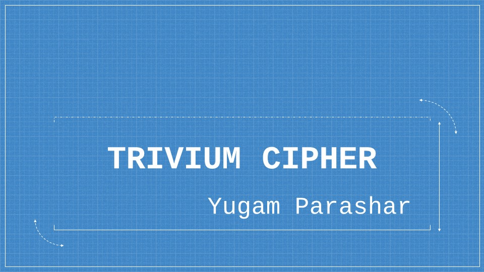
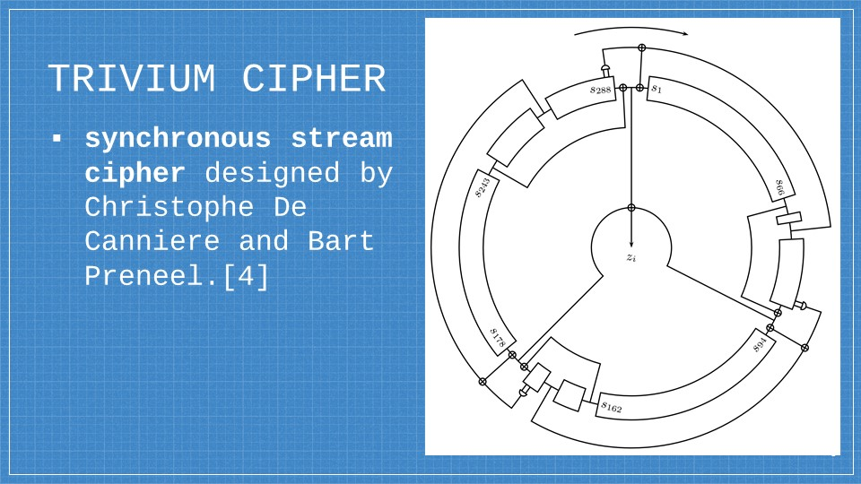

# Trivium Cipher Presentation

## References

-	Estream: The Ecrypt Stream Cipher Project. The eSTREAM portfolio page. (n.d.). Retrieved March 29, 2023, from [ecrypto](https://www.ecrypt.eu.org/stream/)
-	Paar, C., & Pelzl, J. (2010). Understanding Cryptography: Stream Ciphers, Trivium Cipher. Springer. ISBN: 978-3-642-04100-6.
-	"Trivium." eSTREAM. European Network of Excellence for Cryptology. Accessed on March 29, 2023. [Trivium](https://www.ecrypt.eu.org/stream/e2-trivium.html).
-	De Cannière, C., & Preneel, B. (2006). Trivium: A Stream Cipher Construction Inspired by Block Cipher Design Principles. eSTREAM Specification. Accessed on March 29, 2023, from [ecrypt trivium](https://www.ecrypt.eu.org/stream/ciphers/trivium/trivium.pdf).

